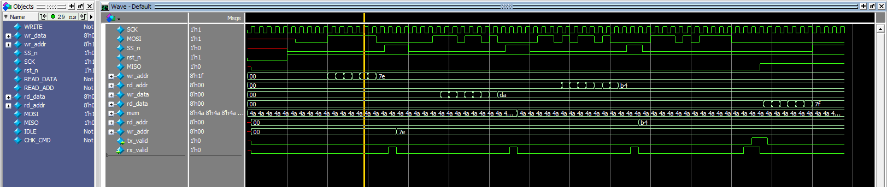

# SPI-Slave-with-Single-Port-RAM
# SPI Master-Slave Communication System (Verilog)

A robust implementation of the **Serial Peripheral Interface (SPI)** protocol in Verilog. This project features a complete Master-Slave architecture designed for reliable synchronous serial data exchange between digital components.

---

## 🛰 Project Overview
The SPI System allows for full-duplex communication using a 4-wire interface. This implementation is highly modular, making it easy to integrate into larger SoC (System on Chip) designs or FPGA projects.

### Core Components:
* **SPI Master:** Controls the clock (SCK), initiates data transfers, and manages Slave Selection (SS).
* **SPI Slave:** Responds to the master's clock and exchanges data via the MISO line.
* **Synchronous Data Path:** Ensures data integrity across different clock domains.

---

## 🛠 Technical Specifications
* **Interface:** 4-Wire (SCK, MOSI, MISO, SS).
* **Communication:** Full-Duplex (simultaneous transmit and receive).
* **Data Width:** 8-bit (configurable).
* **Clocking:** Supports configurable CPOL (Clock Polarity) and CPHA (Clock Phase).

---

## 🏗 System Architecture
The design consists of two primary modules working in tandem:

1.  **Master Controller:** Contains the baud rate generator and shift registers to drive the MOSI line.
2.  **Slave Controller:** Monitors the SS (Slave Select) line and shifts data out to the MISO line upon receiving the SCK signal.

---

## 📊 Simulation & Verification
The system was verified using a testbench that simulates a complete data exchange cycle.

### Simulation Waveform

*Figure 1: Timing diagram showing successful 8-bit data transfer between Master and Slave.*

---

---
**Developed by [Your Name]** *Specializing in Digital Logic Design and Protocol Implementations.*
